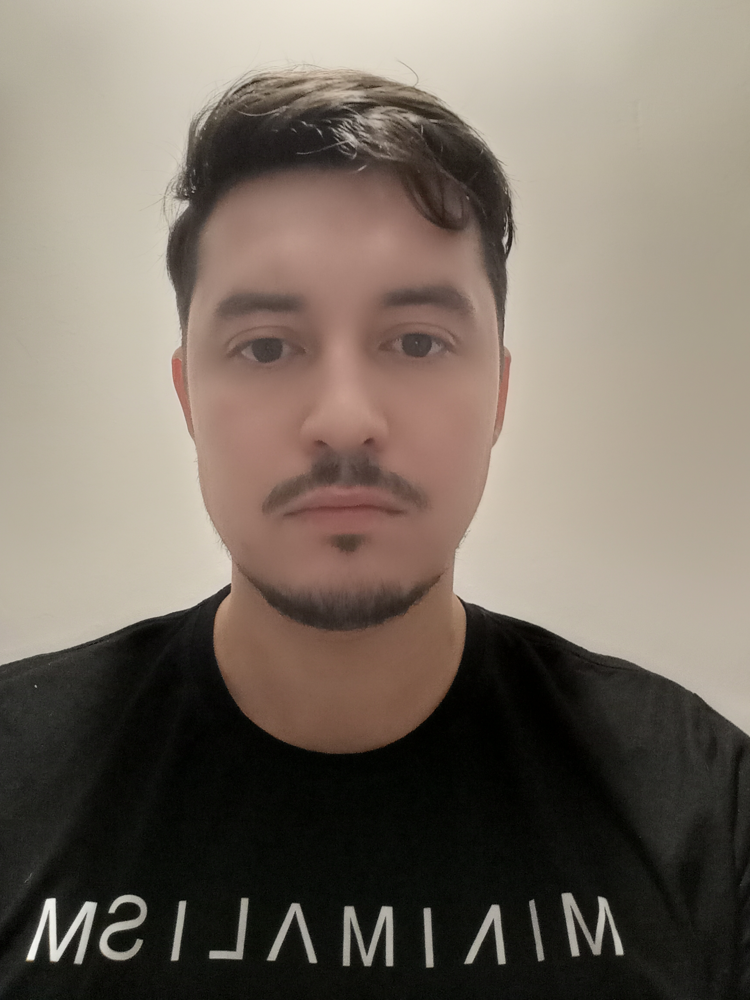

привет , меня зовут Анатолий

мне 31

живу в провинциальном городе Тольятти , на берегу Волги

Работаю в достаточно крупной розничной сети по продажам запасных частей на отечественные грузовые авто

в данной организации уже более 2 лет занимаю пост руководителя филиала

в свободное от работы время хожу на кроссфит, читаю развивающую литературу, практикую йогу, развиваю художественную и музыкальную стороны

обучение в нетологии даётся не очень легко, но кажется справляюсь, надеюсь в дальнейшем если и не полностью уйти в данную профессию , то отчасти заниматься в данной сфере саморазвитием 
